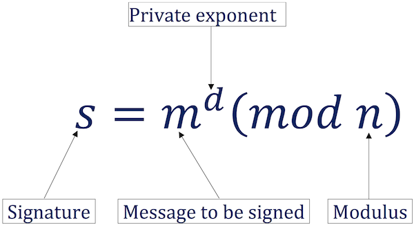

# Access Google IAP-secured resources using Qt (without OpenSSL)

This is a an example of how to access Google IAP-secured resources using Qt.

## Solution overview


The JWT signature is calculated directly using the formula



The code was heavily inspired by this great article [RSA sign and verify: Behind the scene](https://medium.com/@bn121rajesh/rsa-sign-and-verify-using-openssl-behind-the-scene-bf3cac0aade2)

## Build and run 

Open QtCreator and build the project.

Example of usage

```bash
./gcp_ip "key.json" "audience" "https://example.com"
```

You will need to provide a the key.json file and the audience.

You can follow the tutorial from here [IAP on GKE](https://hodo.dev/posts/post-26-gcp-iap/)
to have a working example of a IAP-secured resource.

